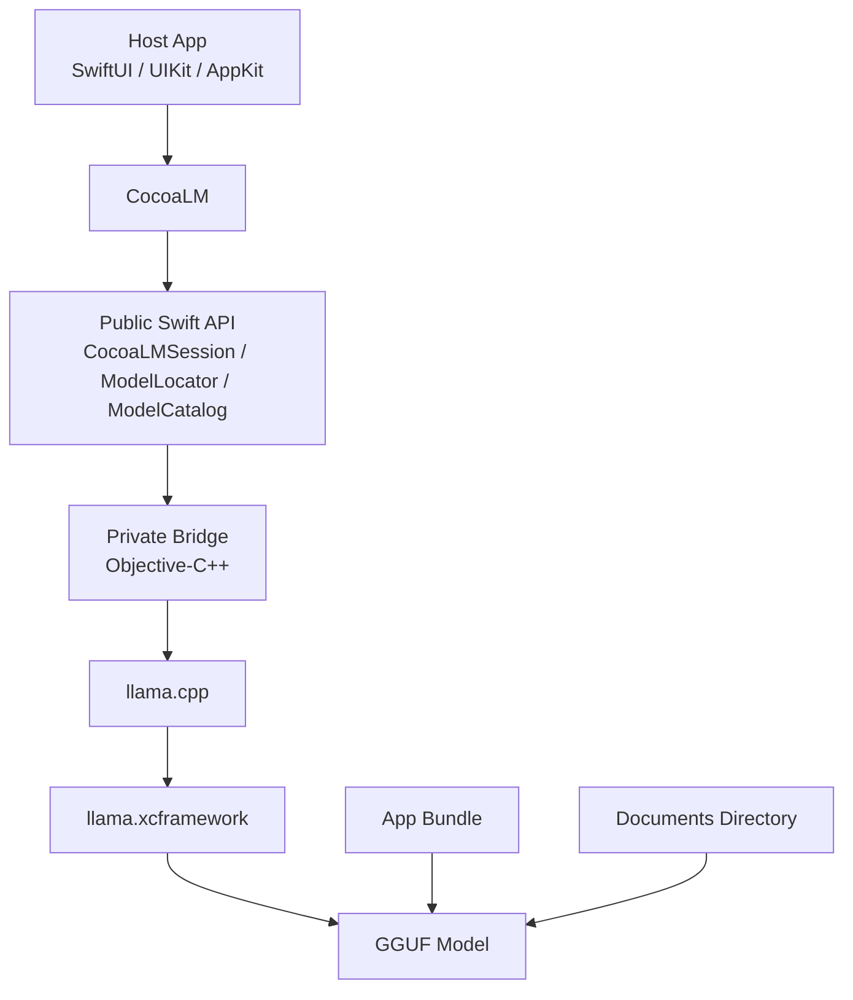

# CocoaLM

Local LLM runtime for Swift apps on Apple platforms.

## Language

- [English](#english)
- [Español](#español)

## English

CocoaLM is a Swift-first local LLM runtime for Apple platforms. It gives you a clean async API for running GGUF models inside iOS, macOS, tvOS, and visionOS apps without forcing your product code to deal with `llama.cpp` internals.

It is designed for teams that want on-device generation in real apps: structured output, lightweight assistants, local classifiers, offline-first flows, and product-specific prompting handled in app code.

## Why CocoaLM

- Swift-first integration instead of a raw C or C++ surface.
- Apple-platform focused packaging for app teams, not just CLI experiments.
- Small public API that stays product-agnostic.
- Clear separation between runtime concerns and application logic.
- Works well for structured output, local routing, and controlled inference flows.

## What CocoaLM ships

- A Swift package with a small public API.
- A private Objective-C++ bridge that wraps `llama.cpp`.
- A binary dependency on `llama.xcframework`.
- Utilities for locating GGUF models in the app bundle or documents directory.

## What CocoaLM does not ship

- It does not bundle large GGUF models through Swift Package Manager.
- It does not download models for you.
- It does not define product-specific prompts or output schemas.

That separation is intentional: the package owns the runtime, while the host app owns model choice, prompt design, and product behavior.

## What is llama.cpp

`llama.cpp` is an open-source local inference engine for running language models on device.

It became popular because it made it practical to run quantized models outside the cloud, including in desktop and mobile environments. Today it is commonly used as the execution layer behind many local LLM apps and tools.

In CocoaLM, `llama.cpp` is the part that loads the GGUF model file and performs text generation. CocoaLM does not expose that low-level runtime directly. Instead, it wraps it behind a Swift-first API designed for Apple apps.

## What is GGUF

GGUF is the model file format commonly used by `llama.cpp` and similar local runtimes. In practice, it is the file your app ships or downloads so the runtime can load a language model on device.

In CocoaLM, the package provides the runtime layer, while the host app provides the `.gguf` model file.

## Model compatibility

CocoaLM is not limited to the built-in Qwen recommendation. You can use any GGUF model that is compatible with the packaged `llama.cpp` runtime and fits the memory and performance constraints of your target device.

In practice, model compatibility depends on:

- whether the model is exported as a valid GGUF file
- whether the bundled runtime supports that architecture and quantization
- whether the model size is realistic for the target device
- whether the model quality is good enough for your product task

`ModelCatalog` is intentionally small. It provides a few known-good recommendations, but you can always create your own `ModelDescriptor` for a different GGUF model.

## Installation

Add the package to your project with Swift Package Manager:

```swift
.package(url: "https://github.com/JimmyDevCode/CocoaLM.git", from: "0.1.1")
```

Then add `CocoaLM` to your target dependencies.

## Public API

- `CocoaLMRuntime`: runtime availability checks.
- `ModelDescriptor`: metadata for a GGUF model file.
- `ModelCatalog`: built-in model recommendations.
- `ModelLocationStrategy`: search order for bundle and documents directory.
- `ModelLocator`: resolves local model file URLs.
- `GenerationConfig`: token and sampling configuration.
- `CocoaLMSession`: high-level async generation entry point.
- `CocoaLMError`: typed runtime and generation errors.

## Status

The package is now distributed through Swift Package Manager using a hosted binary artifact for the bundled `llama.xcframework`.

The framework runtime is shipped through GitHub Releases, while GGUF model files remain the responsibility of the host application.

## Model files

CocoaLM expects the model file to live outside the package itself.

Supported locations:

1. Your app bundle.
2. Your app's documents directory.

The built-in `ModelLocator` searches those locations using the filename declared by `ModelDescriptor`.

## Add your first GGUF model

For a first integration, use the built-in Qwen recommendation:

- `ModelCatalog.qwen15BInstructQ4`
- expected filename: `qwen2.5-1.5b-instruct-q4_k_m.gguf`

### Where to get a GGUF model

Recommended source:

- Qwen2.5 1.5B Instruct GGUF: <https://huggingface.co/Qwen/Qwen2.5-1.5B-Instruct-GGUF>

Download the file that matches the descriptor filename:

- `qwen2.5-1.5b-instruct-q4_k_m.gguf`

### How to add the model to your app bundle

In Xcode:

1. Drag the `.gguf` file into your project navigator.
2. Enable `Copy items if needed` if the file lives outside your app project.
3. Make sure your app target is checked.
4. Build the app so the model is copied into the final bundle.

If you prefer, you can also download the model at runtime and store it in the app's documents directory.

If you ship the model in the app bundle, keep in mind that the final app size will increase significantly.

### How to load the model with CocoaLM

Typical flow:

1. Download the `.gguf` file.
2. Add it to your app bundle or place it in the app's documents directory.
3. Create a session with `ModelCatalog.qwen15BInstructQ4`.

Example bundle lookup:

```swift
import CocoaLM

if let url = ModelLocator.locate(
    ModelCatalog.qwen15BInstructQ4,
    strategy: .bundleThenDocuments
) {
    print("Model found at:", url.path)
}
```

Example session creation after adding the model to your app:

```swift
import CocoaLM

let session = try CocoaLMSession(
    model: ModelCatalog.qwen15BInstructQ4,
    strategy: .bundleThenDocuments
)
```

## Quick start

This assumes the GGUF model file is already present in your app bundle or documents directory.

```swift
import CocoaLM

let session = try CocoaLMSession(
    model: ModelCatalog.qwen15BInstructQ4,
    generationConfig: GenerationConfig(
        contextLength: 1024,
        maxTokens: 160,
        temperature: 0.2
    )
)

let output = try await session.generate(
    userPrompt: "Return a JSON object describing the user's mood.",
    systemPrompt: "You are a structured output assistant. Return JSON only."
)
```

## API examples

Create a session from an explicit file URL:

```swift
import CocoaLM

let modelURL = Bundle.main.url(
    forResource: "qwen2.5-1.5b-instruct-q4_k_m",
    withExtension: "gguf"
)!

let session = try CocoaLMSession(
    model: ModelCatalog.qwen15BInstructQ4,
    modelURL: modelURL,
    generationConfig: GenerationConfig(
        contextLength: 1024,
        maxTokens: 160,
        temperature: 0.2
    )
)
```

Check runtime availability before enabling local generation:

```swift
if CocoaLMRuntime.isAvailable {
    // Enable local inference features.
}
```

## GenerationConfig

`GenerationConfig` controls context size, output length, and sampling behavior.

Use lower temperatures for structured output and classification. Use higher temperatures only when you want more varied text.

For practical guidance and fuller examples, see [Documentation/API_EXAMPLES.md](Documentation/API_EXAMPLES.md).

## Architecture



## Documentation guide

- [Documentation/API_EXAMPLES.md](Documentation/API_EXAMPLES.md): full examples for the public API.
- [Documentation/ARCHITECTURE.md](Documentation/ARCHITECTURE.md): internal design decisions, package boundaries, and runtime notes.
- [Documentation/RELEASING.md](Documentation/RELEASING.md): release workflow for maintainers.
- [CONTRIBUTING.md](CONTRIBUTING.md): contribution guidelines and documentation boundaries.

## Repository layout

- `Sources/CocoaLM/`: public Swift API.
- `Sources/CocoaLMBridge/`: internal Objective-C++ bridge.
- `Tests/`: package-level unit tests.
- `Documentation/`: design notes, release notes, and API examples.

## More examples

For a complete example that covers the full public API surface, including `CocoaLMError`, see [Documentation/API_EXAMPLES.md](Documentation/API_EXAMPLES.md).

## Development note

For local development of the runtime itself, you can still build a fresh `llama.xcframework` from `llama.cpp` and publish a new release artifact when cutting a new version.

## Español

CocoaLM es un runtime local de LLM orientado a Swift para plataformas Apple. Te da una API `async` limpia para ejecutar modelos GGUF dentro de apps para iOS, macOS, tvOS y visionOS sin obligarte a exponer `llama.cpp` en tu código de producto.

Está pensado para equipos que quieren inferencia on-device en apps reales: salida estructurada, asistentes ligeros, clasificadores locales, flujos offline-first y prompts específicos de producto resueltos desde la app anfitriona.

## Por qué CocoaLM

- Integración pensada para Swift en lugar de una superficie cruda de C o C++.
- Empaquetado enfocado en apps Apple, no solo en experimentos de consola.
- API pública pequeña y agnóstica al producto.
- Separación clara entre runtime y lógica de aplicación.
- Encaja bien en flujos de salida estructurada, routing local e inferencia controlada.

## Qué incluye CocoaLM

- Un paquete Swift con una API pública pequeña.
- Un bridge privado en Objective-C++ que encapsula `llama.cpp`.
- Una dependencia binaria sobre `llama.xcframework`.
- Utilidades para localizar modelos GGUF en el bundle de la app o en el directorio Documents.

## Qué no incluye CocoaLM

- No distribuye modelos GGUF grandes a través de Swift Package Manager.
- No descarga modelos por ti.
- No define prompts específicos de producto ni esquemas de salida.

Esa separación es intencional: el paquete se encarga del runtime, mientras la app anfitriona se encarga de elegir el modelo, diseñar prompts y definir el comportamiento de producto.

## Qué es llama.cpp

`llama.cpp` es un motor open source de inferencia local para ejecutar modelos de lenguaje directamente en el dispositivo.

Se volvió popular porque hizo práctico correr modelos cuantizados fuera de la nube, incluyendo entornos de escritorio y móviles. Hoy suele usarse como capa de ejecución detrás de muchas apps y herramientas de LLM local.

En CocoaLM, `llama.cpp` es la parte que carga el archivo GGUF y realiza la generación de texto. CocoaLM no expone ese runtime de bajo nivel directamente. En su lugar, lo encapsula detrás de una API pensada para Swift y plataformas Apple.

## Qué es GGUF

GGUF es el formato de archivo de modelos que suelen usar `llama.cpp` y runtimes parecidos de inferencia local. En la práctica, es el archivo que tu app distribuye o descarga para que el runtime pueda cargar el modelo en el dispositivo.

En CocoaLM, el paquete aporta la capa de runtime, mientras la app anfitriona aporta el archivo de modelo `.gguf`.

## Compatibilidad de modelos

CocoaLM no está limitado a la recomendación incluida de Qwen. Puedes usar cualquier modelo GGUF que sea compatible con el runtime empaquetado de `llama.cpp` y que entre dentro de las restricciones reales de memoria y rendimiento del dispositivo objetivo.

En la práctica, la compatibilidad depende de:

- que el modelo esté exportado como un archivo GGUF válido
- que el runtime incluido soporte esa arquitectura y cuantización
- que el tamaño del modelo sea realista para el dispositivo objetivo
- que la calidad del modelo sea suficiente para la tarea de tu producto

`ModelCatalog` es intencionalmente pequeño. Da unas cuantas recomendaciones conocidas, pero siempre puedes crear tu propio `ModelDescriptor` para otro modelo GGUF.

## Instalación

Agrega el paquete a tu proyecto con Swift Package Manager:

```swift
.package(url: "https://github.com/JimmyDevCode/CocoaLM.git", from: "0.1.1")
```

Luego agrega `CocoaLM` a las dependencias de tu target.

## API pública

- `CocoaLMRuntime`: verificación de disponibilidad del runtime.
- `ModelDescriptor`: metadatos de un archivo GGUF.
- `ModelCatalog`: recomendaciones de modelos incluidas.
- `ModelLocationStrategy`: orden de búsqueda entre bundle y Documents.
- `ModelLocator`: resolución de URLs locales del modelo.
- `GenerationConfig`: configuración de tokens y muestreo.
- `CocoaLMSession`: punto de entrada `async` para generar texto.
- `CocoaLMError`: errores tipados del runtime y la generación.

## Estado

El paquete ya se distribuye mediante Swift Package Manager usando un artefacto binario hospedado para el `llama.xcframework`.

El runtime del framework se distribuye a través de GitHub Releases, mientras que los archivos GGUF siguen siendo responsabilidad de la app anfitriona.

## Archivos de modelo

CocoaLM espera que el archivo del modelo viva fuera del paquete.

Ubicaciones soportadas:

1. El bundle de tu app.
2. El directorio Documents de tu app.

`ModelLocator` busca en esas ubicaciones usando el nombre de archivo declarado por `ModelDescriptor`.

## Añade tu primer modelo GGUF

Para una primera integración, usa la recomendación incluida de Qwen:

- `ModelCatalog.qwen15BInstructQ4`
- nombre de archivo esperado: `qwen2.5-1.5b-instruct-q4_k_m.gguf`

### Dónde conseguir un modelo GGUF

Fuente recomendada:

- Qwen2.5 1.5B Instruct GGUF: <https://huggingface.co/Qwen/Qwen2.5-1.5B-Instruct-GGUF>

Descarga el archivo que coincide con el nombre esperado por el descriptor:

- `qwen2.5-1.5b-instruct-q4_k_m.gguf`

### Cómo añadir el modelo al bundle de tu app

En Xcode:

1. Arrastra el archivo `.gguf` al navegador del proyecto.
2. Activa `Copy items if needed` si el archivo vive fuera del proyecto.
3. Asegúrate de marcar el target de tu app.
4. Compila la app para que el modelo sea copiado al bundle final.

Si prefieres, también puedes descargar el modelo en runtime y guardarlo en el directorio Documents de la app.

Si distribuyes el modelo dentro del bundle, ten en cuenta que el tamaño final de la app crecerá bastante.

### Cómo cargar el modelo con CocoaLM

Flujo típico:

1. Descarga el archivo `.gguf`.
2. Añádelo al bundle de tu app o colócalo en el directorio Documents de la app.
3. Crea una sesión con `ModelCatalog.qwen15BInstructQ4`.

Ejemplo de búsqueda en el bundle:

```swift
import CocoaLM

if let url = ModelLocator.locate(
    ModelCatalog.qwen15BInstructQ4,
    strategy: .bundleThenDocuments
) {
    print("Modelo encontrado en:", url.path)
}
```

Ejemplo de creación de sesión después de añadir el modelo a la app:

```swift
import CocoaLM

let session = try CocoaLMSession(
    model: ModelCatalog.qwen15BInstructQ4,
    strategy: .bundleThenDocuments
)
```

## Inicio rápido

Esto asume que el archivo GGUF ya está presente en el bundle de tu app o en el directorio Documents.

```swift
import CocoaLM

let session = try CocoaLMSession(
    model: ModelCatalog.qwen15BInstructQ4,
    generationConfig: GenerationConfig(
        contextLength: 1024,
        maxTokens: 160,
        temperature: 0.2
    )
)

let output = try await session.generate(
    userPrompt: "Return a JSON object describing the user's mood.",
    systemPrompt: "You are a structured output assistant. Return JSON only."
)
```

## Ejemplos de API

Crear una sesión desde una URL explícita:

```swift
import CocoaLM

let modelURL = Bundle.main.url(
    forResource: "qwen2.5-1.5b-instruct-q4_k_m",
    withExtension: "gguf"
)!

let session = try CocoaLMSession(
    model: ModelCatalog.qwen15BInstructQ4,
    modelURL: modelURL,
    generationConfig: GenerationConfig(
        contextLength: 1024,
        maxTokens: 160,
        temperature: 0.2
    )
)
```

Verificar el runtime antes de habilitar inferencia local:

```swift
if CocoaLMRuntime.isAvailable {
    // Activa funciones de inferencia local.
}
```

## GenerationConfig

`GenerationConfig` controla el tamaño de contexto, la longitud máxima de salida y el comportamiento del muestreo.

Usa temperaturas bajas para salida estructurada y clasificación. Usa temperaturas más altas solo cuando quieras texto más variado.

Para una guía más práctica y ejemplos completos, revisa [Documentation/API_EXAMPLES.md](Documentation/API_EXAMPLES.md).

## Arquitectura


## Guía de documentación

- [Documentation/API_EXAMPLES.md](Documentation/API_EXAMPLES.md): ejemplos completos de la API pública.
- [Documentation/ARCHITECTURE.md](Documentation/ARCHITECTURE.md): decisiones internas de diseño, límites del package y notas del runtime.
- [Documentation/RELEASING.md](Documentation/RELEASING.md): flujo de publicación para maintainers.
- [CONTRIBUTING.md](CONTRIBUTING.md): guía para contribuir y límites de la documentación.

## Estructura del repositorio

- `Sources/CocoaLM/`: API pública en Swift.
- `Sources/CocoaLMBridge/`: bridge interno en Objective-C++.
- `Tests/`: tests del paquete.
- `Documentation/`: notas de arquitectura, publicación y ejemplos de API.

## Más ejemplos

Para un ejemplo completo que cubre toda la API pública, incluido `CocoaLMError`, revisa [Documentation/API_EXAMPLES.md](Documentation/API_EXAMPLES.md).

## Nota de desarrollo

Para iterar sobre el runtime, puedes compilar un `llama.xcframework` nuevo a partir de `llama.cpp`, subirlo como artefacto de release y actualizar el `checksum` y la URL en `Package.swift` al publicar una nueva versión.
