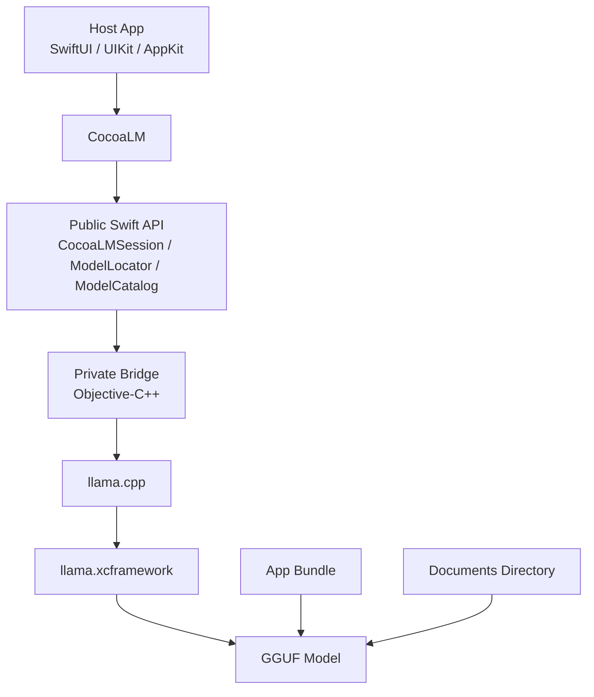

# CocoaLM

Local LLM runtime for Swift apps on Apple platforms.

## Language

- [English](#english)
- [Español](#español)

## English

CocoaLM is a Swift-first package that lets you run GGUF language models inside iOS, macOS, tvOS, and visionOS apps using a simple async API, with `llama.cpp` under the hood.

## What CocoaLM ships

- A Swift package with a small public API.
- A private Objective-C++ bridge that wraps `llama.cpp`.
- A binary dependency on `llama.xcframework`.
- Utilities for locating GGUF models in the app bundle or documents directory.

## What CocoaLM does not ship

- It does not bundle large GGUF models through Swift Package Manager.
- It does not download models for you.
- It does not define product-specific prompts or output schemas.

That separation is intentional: the package owns the runtime, while the host app owns model choice, prompt design, and product behavior.

## Installation

Add the package to your project with Swift Package Manager:

```swift
.package(url: "https://github.com/JimmyDevCode/CocoaLM.git", from: "0.1.0")
```

Then add `CocoaLM` to your target dependencies.

## Status

The package is now distributed through Swift Package Manager using a hosted binary artifact for the bundled `llama.xcframework`.

The framework runtime is shipped through GitHub Releases, while GGUF model files remain the responsibility of the host application.

## Adding a GGUF model

Ship the model separately from the package:

1. Add a `.gguf` file to your app bundle.
2. Or store the `.gguf` file in the app's documents directory.

The built-in `ModelLocator` searches those locations for the filename declared by `ModelDescriptor`.

## Add your first GGUF model

For a first integration, use the built-in Qwen recommendation:

- `ModelCatalog.qwen15BInstructQ4`
- expected filename: `qwen2.5-1.5b-instruct-q4_k_m.gguf`

Typical flow:

1. Download the `.gguf` file.
2. Add it to your app bundle or place it in the app's documents directory.
3. Create a session with `ModelCatalog.qwen15BInstructQ4`.

If you ship the model in the app bundle, keep in mind that the app size will increase significantly.

## Quick start

```swift
import CocoaLM

let session = try CocoaLMSession(
    model: ModelCatalog.qwen15BInstructQ4,
    generationConfig: GenerationConfig(
        contextLength: 1024,
        maxTokens: 160,
        temperature: 0.2
    )
)

let output = try await session.generate(
    userPrompt: "Return a JSON object describing the user's mood.",
    systemPrompt: "You are a structured output assistant. Return JSON only."
)
```

## Architecture



## Recommended package design

- Keep the package focused on runtime concerns.
- Keep logs and documentation in English.
- Keep the public API small and product-agnostic.
- Keep model distribution outside SPM.
- Keep app-specific prompts, parsers, and safety policies in the host app.

## Repository layout

- `Sources/CocoaLM/`: public Swift API.
- `Sources/CocoaLMBridge/`: internal Objective-C++ bridge.
- `Tests/`: package-level unit tests.
- `Documentation/`: design notes and architecture docs.

## Development note

For local development of the runtime itself, you can still build a fresh `llama.xcframework` from `llama.cpp` and publish a new release artifact when cutting a new version.

## Español

CocoaLM es un paquete orientado a Swift que permite ejecutar modelos GGUF dentro de apps para iOS, macOS, tvOS y visionOS con una API `async` simple, usando `llama.cpp` por debajo.

## Qué incluye CocoaLM

- Un paquete Swift con una API pública pequeña.
- Un bridge privado en Objective-C++ que encapsula `llama.cpp`.
- Una dependencia binaria sobre `llama.xcframework`.
- Utilidades para localizar modelos GGUF en el bundle de la app o en el directorio Documents.

## Qué no incluye CocoaLM

- No distribuye modelos GGUF grandes a través de Swift Package Manager.
- No descarga modelos por ti.
- No define prompts específicos de producto ni esquemas de salida.

Esa separación es intencional: el paquete se encarga del runtime, mientras la app anfitriona se encarga de elegir el modelo, diseñar prompts y definir el comportamiento de producto.

## Instalación

Agrega el paquete a tu proyecto con Swift Package Manager:

```swift
.package(url: "https://github.com/JimmyDevCode/CocoaLM.git", from: "0.1.0")
```

Luego agrega `CocoaLM` a las dependencias de tu target.

## Estado

El paquete ya se distribuye mediante Swift Package Manager usando un artefacto binario hospedado para el `llama.xcframework`.

El runtime del framework se distribuye a través de GitHub Releases, mientras que los archivos GGUF siguen siendo responsabilidad de la app anfitriona.

## Cómo añadir un modelo GGUF

Distribuye el modelo aparte del paquete:

1. Añade un archivo `.gguf` al bundle de tu app.
2. O guarda el archivo `.gguf` en el directorio Documents de la app.

`ModelLocator` busca en esas ubicaciones usando el nombre de archivo declarado por `ModelDescriptor`.

## Añade tu primer modelo GGUF

Para una primera integración, usa la recomendación incluida de Qwen:

- `ModelCatalog.qwen15BInstructQ4`
- nombre de archivo esperado: `qwen2.5-1.5b-instruct-q4_k_m.gguf`

Flujo típico:

1. Descarga el archivo `.gguf`.
2. Añádelo al bundle de tu app o colócalo en el directorio Documents de la app.
3. Crea una sesión con `ModelCatalog.qwen15BInstructQ4`.

Si distribuyes el modelo dentro del bundle, ten en cuenta que el tamaño final de la app crecerá bastante.

## Inicio rápido

```swift
import CocoaLM

let session = try CocoaLMSession(
    model: ModelCatalog.qwen15BInstructQ4,
    generationConfig: GenerationConfig(
        contextLength: 1024,
        maxTokens: 160,
        temperature: 0.2
    )
)

let output = try await session.generate(
    userPrompt: "Return a JSON object describing the user's mood.",
    systemPrompt: "You are a structured output assistant. Return JSON only."
)
```

## Arquitectura


## Recomendaciones de diseño

- Mantén el paquete enfocado en el runtime.
- Mantén logs y documentación en inglés.
- Mantén la API pública pequeña y agnóstica al producto.
- Mantén la distribución de modelos fuera de SPM.
- Mantén prompts, parsers y políticas de seguridad específicas de producto dentro de la app anfitriona.

## Estructura del repositorio

- `Sources/CocoaLM/`: API pública en Swift.
- `Sources/CocoaLMBridge/`: bridge interno en Objective-C++.
- `Tests/`: tests del paquete.
- `Documentation/`: notas de arquitectura y publicación.

## Nota de desarrollo

Para desarrollo del runtime, todavía puedes compilar un `llama.xcframework` nuevo desde `llama.cpp` y publicar un nuevo artefacto de release al sacar una versión.
